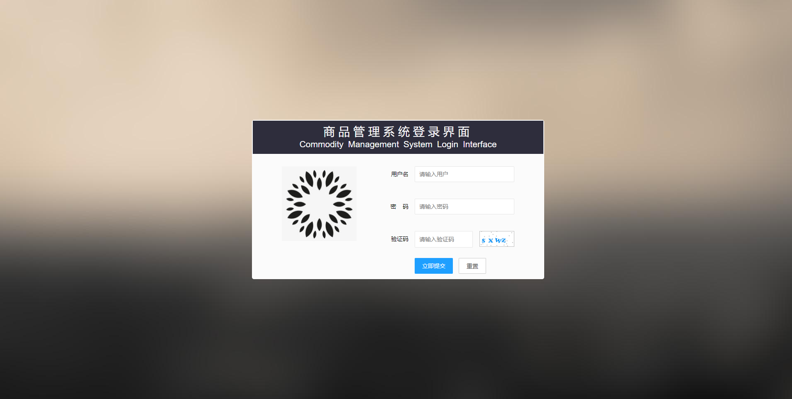
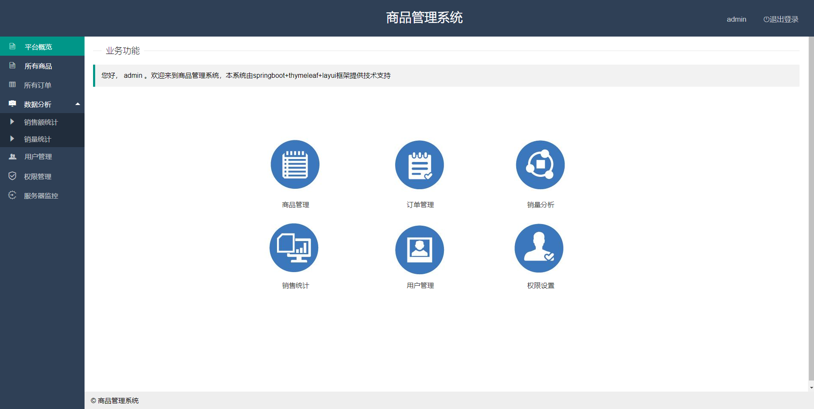
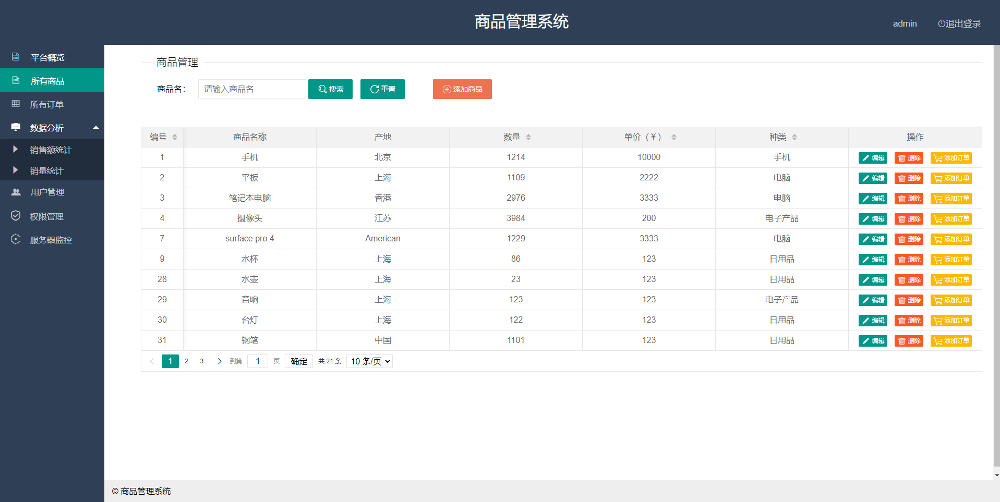
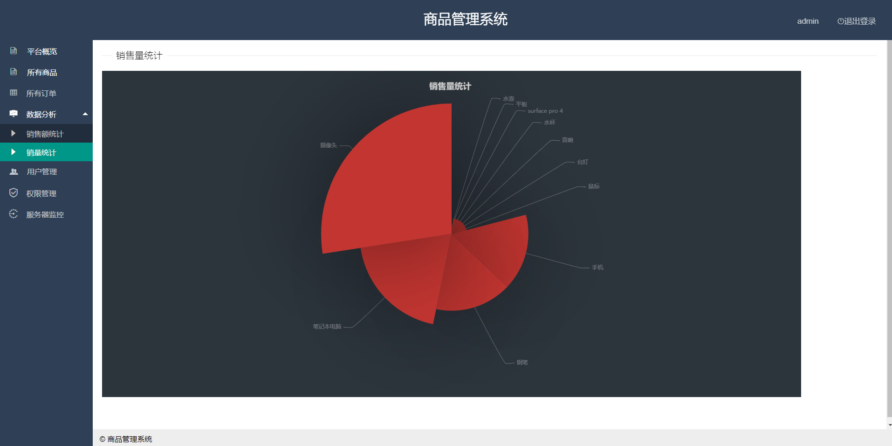
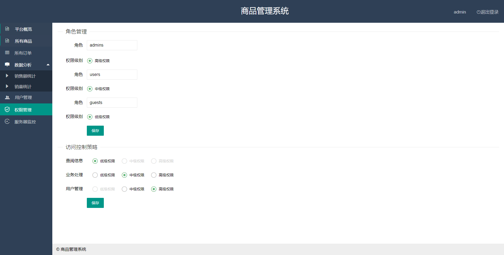
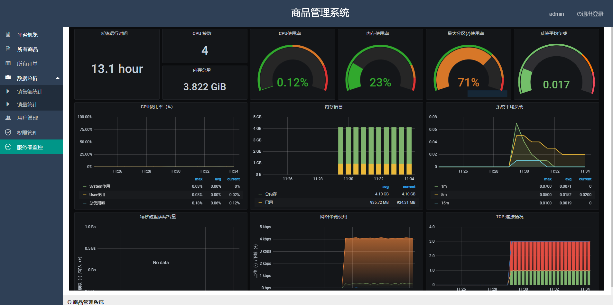

# 学习项目——商品管理系统（Spring Boot+Layui+Thymeleaf+MyBatis(plus)）

**(NOT SUITABLE FOR ANY PROGRAMMER) **

**Commodity Management System**-------A Learning projects I programmed last summer.

I uploaded this project just to keep a backup , I would be happy if this simple and incomplete and also buggy project  can help you even a little.

**Spring Boot** for Backend.

**Layui** and **Thymeleaf** for Frontend.

**Mybatis** and **Mybatis** plus are used to design SQL queries.

**Echarts** for data demonstration.

**Prometheus**+**Grafana** for server monitoring (Not closely related to the project itself ,only used iframe to display Grafana Dashboard ,You can easliy install them by following tutorials in their own official website ,or you can just refer to this note https://github.com/phisabella/StudyNotes/tree/main/Prometheus%2BGrafana%20Notes)

http://127.0.0.1:8080/web/login1 to start after you build it (**IntelliJ IDEA** recommended)

## System functions

1. Basic **CRUD** for commodities, orders, and users.
2. **Data demonstration**, both sales and sales volume.
3. Simple implementation of **Dynamic management** **of permissions**.
4. **Server monitoring **, including CPU ,memory usage and so on. ( **Prometheus** and **Grafana** installed first)

## Known problems and bugs

   1.It might be crashed if you stay in the system too long.

2. When you edit a commodity , a order, or a user,  name will be shown in the search box.
3. Same address could go wrong if you just search it in your browser rather than click it in the system.
4. **Google Chrome** is recommended to open the system to avoid page display problems.
5. and so on

## Screenshots

